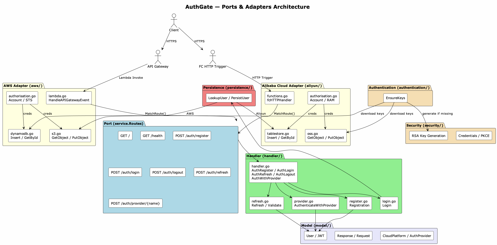
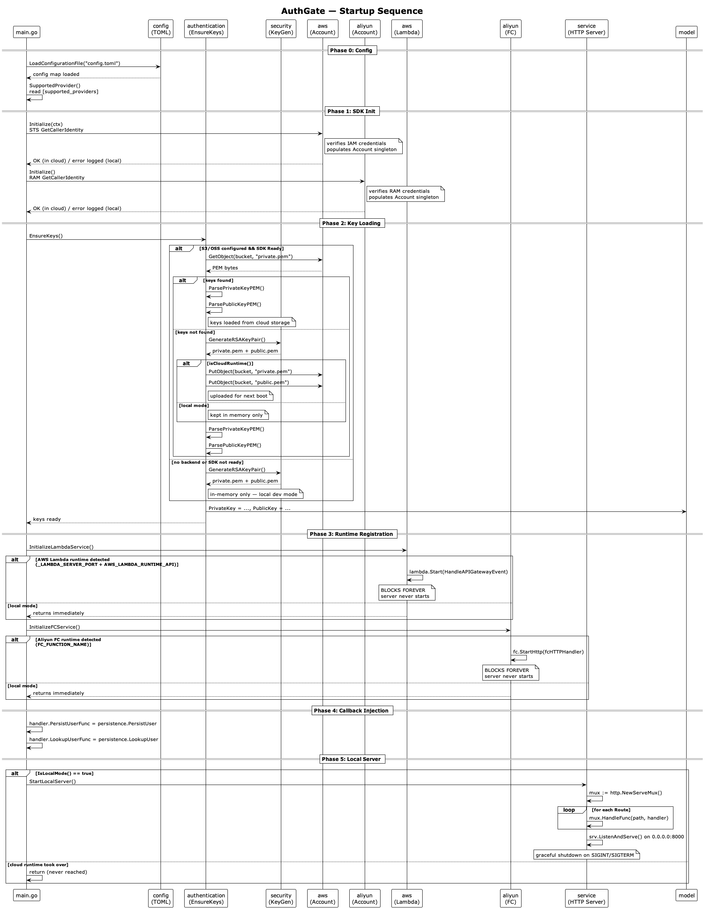
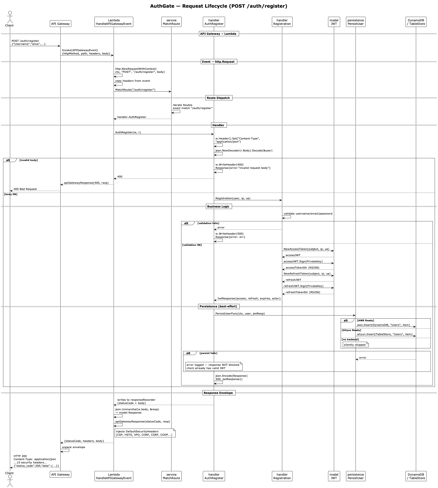
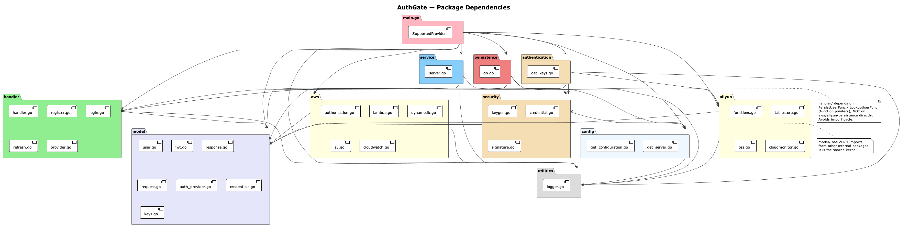
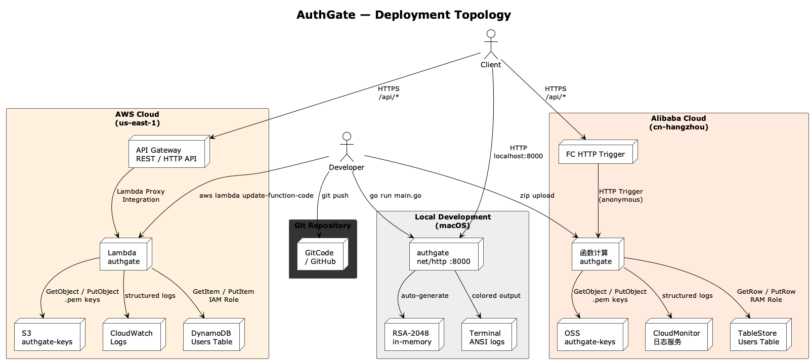

# AuthGate

**Multi-cloud unified authentication gateway** — single Go binary, three runtimes (AWS Lambda, Alibaba Cloud FC, local), shared route table, zero-config environment switching.

[](https://go.dev/)
[](https://datatracker.ietf.org/doc/html/rfc7519)
[](LICENSE)

> [中文文档](README_CN.md)

---

## Table of Contents

1. [Architecture](#architecture)
2. [Project Structure](#project-structure)
3. [Quick Start](#quick-start)
4. [API Reference](#api-reference)
5. [Security Detection](#security-detection)
6. [Rate Limiting & Burst Detection](#rate-limiting--burst-detection)
7. [Configuration Reference](#configuration-reference)
8. [Deployment](#deployment)
9. [Observability & Alerting](#observability--alerting)
10. [JWT Security Design](#jwt-security-design)
11. [Design Decisions](#design-decisions)
12. [Tech Stack](#tech-stack)

---

## Architecture

**Pattern:** Ports & Adapters (Hexagonal Architecture, simplified).

`service.Routes` is the canonical port — a single `[]RouteEntry` slice that defines every API endpoint. Three adapters (`aws/lambda.go`, `aliyun/functions.go`, `service/server.go`) each translate platform-specific invocation protocols into standard `http.HandlerFunc` calls against that same route table.

```
                          ┌──────────────────────────┐
                          │     service.Routes       │  ← Port
                          │  7 routes, all envs      │
                          └─────┬──────────┬─────────┘
                                │          │
                ┌───────────────┘          └───────────────┐
                ▼                                          ▼
  ┌──────────────────────────┐           ┌──────────────────────────┐
  │      aws/lambda.go        │           │    aliyun/functions.go   │  ← Adapters
  │  API Gateway Proxy Event  │           │    FC HTTP Trigger       │
  │  → http.Request           │           │  → http.ResponseWriter   │
  └──────────────────────────┘           └──────────────────────────┘
                │                                          │
                └────────────────┬─────────────────────────┘
                                 ▼
                ┌────────────────────────────────┐
                │  handler (business logic)       │
                │  register / login / refresh /   │
                │  logout / provider              │
                ├────────────────────────────────┤
                │  security (middleware)          │
                │  pattern scan + rate limit      │
                ├────────────────────────────────┤
                │  persistence (DynamoDB/TableStore)│
                │  → via func ptr injection       │
                └────────────────────────────────┘
```



### Startup Sequence (5 phases)

| Phase | Operation | Cloud (Lambda/FC) | Local |
|---|---|---|---|
| 0 | `config.LoadConfigurationFile` | Reads from bundled `config.toml` | Reads from working directory |
| 1 | `aws.Initialize` / `aliyun.Initialize` | STS/RAM `GetCallerIdentity` validates IAM role | Same — but errors are logged, not fatal |
| 2 | `authentication.EnsureKeys` | Downloads `private.pem`/`public.pem` from S3/OSS; if missing → generates RSA-2048 → uploads | Generates RSA-2048 in-memory only |
| 3 | `InitializeLambdaService` / `InitializeFCService` | Registers runtime handler and **blocks forever** | Returns immediately (no-op) |
| 4 | Callback injection | `PersistUserFunc`, `LookupUserFunc`, `SecurityLogFunc` wired | Same |
| 5 | `StartLocalServer` | **Never reached** (runtime took over) | `net/http` on `0.0.0.0:8000` |



### Environment Detection

The runtime is detected by environment variables injected by the cloud platform:

| Env Vars | Runtime | Dispatch Entry Point |
|---|---|---|
| `_LAMBDA_SERVER_PORT` + `AWS_LAMBDA_RUNTIME_API` | AWS Lambda | `HandleAPIGatewayEvent(ctx, APIGatewayEvent)` |
| `FC_FUNCTION_NAME` | Alibaba Cloud FC | `fcHTTPHandler(w, r)` via `fc.StartHttp` |
| Neither | Local development | `net/http.ServeMux` with `SecurityMiddleware` + `logRequest` |

### Request Lifecycle (`POST /auth/register`)

```
Client → API Gateway → Lambda Invoke
                           │
  APIGatewayEvent {         ▼
    httpMethod: "POST"     HandleAPIGatewayEvent()
    path: "/auth/register"   ├─ event → http.Request (reconstructed)
    body: "{...}"            ├─ SecurityMiddleware wraps handler
  }                          │    ├─ RateTracker.Record(IP, Path)
                             │    ├─ io.ReadAll(body) → buffer
                             │    ├─ ScanRequest(body, path, query, headers)
                             │    │    └─ 13 pattern groups, ~90 regexes
                             │    └─ Merge pattern matches + rate matches
                             ├─ service.MatchRoute(path) → handler.AuthRegister
                             │    ├─ json.Decode(body) → model.User
                             │    ├─ Registration() → validate → JWT.Sign(RS256)
                             │    └─ PersistUserFunc() → DynamoDB/TableStore
                             └─ apiGatewayResponse() → {statusCode, headers, body}
                                  │
Client ← HTTP 200 ← API Gateway  ◄
```



### Response Path Differences by Runtime

| Aspect | Local HTTP | AWS Lambda | Aliyun FC |
|---|---|---|---|
| ResponseWriter | Real `http.ResponseWriter` | `responseRecorder` (captures body + status) | Real `http.ResponseWriter` |
| Handler headers | Direct to client | **Discarded** — overwritten by `apiGatewayResponse` | Set before handler; handler can override |
| Security headers | None by default | `DefaultSecurityHeaders` (15 headers) injected | `DefaultSecurityHeaders` injected by `fcHTTPHandler` |
| Body processing | Direct stream | Decode → re-encode (double marshal) | Direct stream |
| Response envelope | Raw HTTP | `{statusCode, headers, body}` (Lambda proxy format) | Raw HTTP (FC runtime unwraps) |

---

## Project Structure

```
AuthGate/
├── main.go                          Entry point, 5-phase startup orchestration
├── config.toml                      Runtime configuration (credentials, tables, buckets)
├── config.toml.example              Template — copy and fill in
├── go.mod / go.sum                  Go 1.26 module dependencies
├── postman_collection.json          Postman collection (7 endpoints + test scripts)
├── README.md / README_CN.md         Documentation (EN / ZH)
├── docs/                            PlantUML diagrams (EN + ZH)
├── out/docs/                        Rendered PNG diagrams
│
└── internal/
    ├── model/                       Domain models — zero internal dependencies (shared kernel)
    │   ├── user.go                  User (GORM tags for future MySQL support)
    │   ├── jwt.go                   JWT struct, Sign(RS256), Validate(), NewAccessToken/RefreshToken
    │   ├── response.go              Response, JwtResponse, Actor, EventType constants
    │   ├── request.go               RequestHttpHeader (15 security headers), EmailPasswordAuthRequest
    │   ├── provider.go              CloudPlatform enum (10 platforms: AWS/ALIYUN/GCP/Azure/...)
    │   ├── auth_provider.go         AuthProvider enum (8 third-party: Google/GitHub/WeChat/...)
    │   ├── credentials.go           AWSAuthorisationKeys, AliyunAuthorisationKeys, KeysConfig
    │   ├── keys.go                  PrivateKey / PublicKey global singletons
    │   └── handler.go               APIGatewayEvent struct for Lambda proxy integration
    │
    ├── config/                      TOML configuration layer
    │   ├── get_configuration.go     LoadConfigurationFile(), GetValue(dotted.key)
    │   └── get_server.go            Addr constant, 7 route path constants
    │
    ├── handler/                     HTTP handlers + business logic
    │   ├── handler.go               Index, Health, AuthRegister, AuthLogin, AuthLogout,
    │   │                            AuthRefresh, AuthWithProvider, extractProvider
    │   ├── register.go              Registration() — validation + JWT access/refresh signing
    │   ├── login.go                 Login() — LookupUserFunc → password verify → JWT issuance
    │   ├── refresh.go               Refresh() — RS256 verification, scope check, reissue
    │   │                            ValidateAccessToken() — public JWT validation utility
    │   ├── provider.go              AuthenticateWithProvider() — 8 third-party providers
    │   └── middleware.go            SecurityMiddleware — pattern scan + rate limit per request
    │
    ├── service/                     Service orchestration
    │   └── server.go                Routes (canonical route table), MatchRoute(),
    │                                IsLocalMode(), StartLocalServer() with graceful shutdown
    │
    ├── authentication/              JWT key lifecycle management
    │   └── get_keys.go              EnsureKeys() — download → generate → upload → install
    │                                GetPrivateKey(), GetPublicKey() accessors
    │
    ├── security/                    Security infrastructure
    │   ├── monitor.go               ScanRequest() — 13 pattern groups, ~90 compiled regexes
    │   │                            8 severity levels, multi-source (body/path/query/headers)
    │   ├── ratelimit.go             RateTracker — sliding window, per-IP/path/IP+path/global
    │   │                            5 threshold levels → ThreatMatch emission
    │   ├── keygen.go                GenerateRSAKeyPair() — RSA-2048, PKCS#8 PEM
    │   │                            ParsePrivateKeyPEM(), ParsePublicKeyPEM()
    │   ├── credential.go            AWSCredentials(), AliyunCredentials(), KeysConfig()
    │   └── signature.go             PKCE: ComputeCodeChallenge(), ValidateCodeVerifier()
    │
    ├── persistence/                 Database bridge (callback injection pattern)
    │   └── db.go                    LookupUser(), PersistUser() — auto-detect DynamoDB/TableStore
    │                                Ready() check prevents panic on uninitialized SDK
    │
    ├── aws/                         AWS adapter
    │   ├── authorisation.go         Account singleton, Initialize() via STS GetCallerIdentity
    │   ├── lambda.go                HandleAPIGatewayEvent(), responseRecorder,
    │   │                            apiGatewayResponse() with security headers
    │   ├── dynamodb.go              Insert, GetById, Update, DeleteById — lazy client
    │   ├── s3.go                    GetObject, PutObject, ListObjects, PresignedURL
    │   └── cloudwatch.go            LogSecurityEvent (JSON), EmitSecurityMetric (EMF),
    │                                LogStartupInfo, LogThreatSummary,
    │                                documented metric filters + alarm configs
    │
    ├── aliyun/                      Alibaba Cloud adapter
    │   ├── authorisation.go         Account singleton, Initialize() via RAM GetCallerIdentity
    │   ├── functions.go             fcHTTPHandler(), responseRecorder,
    │   │                            InitializeFCService() auto-detect
    │   ├── tablestore.go            Insert, GetById, Update, DeleteById — lazy client
    │   ├── oss.go                   GetObject, PutObject, ListObjects, PresignedURL
    │   └── cloudmonitor.go          LogSecurityEvent (JSON), LogStartupInfo,
    │                                LogThreatSummary, documented SLS queries + alert rules
    │
    └── utilities/                   Shared utilities
        └── logger.go                Structured block logger (Logf), colour-coded ANSI output,
                                     CloudWatch/SLS-compatible, goroutine correlation (TASK-###),
                                     Mask(), RetryWithBackoff(), Bold()
```



**Key dependency rule:** `model/` imports zero other `internal/` packages. `handler/` depends on `aws`/`aliyun` only through function pointers (`PersistUserFunc`, `LookupUserFunc`, `SecurityLogFunc`) injected by `main.go` — no import cycles.

---

## Quick Start

### Prerequisites

- **Go ≥ 1.26**
- (Optional) AWS account with IAM user (S3 + DynamoDB + STS permissions)
- (Optional) Alibaba Cloud account with RAM user (OSS + TableStore + RAM permissions)

### Local Development — Zero Dependencies

```bash
cp config.toml.example config.toml
go run main.go
```

What happens at startup:
1. `config.toml` parsed
2. `authentication.EnsureKeys()` detects no cloud backend configured
3. RSA-2048 key pair generated **in memory** (never touches disk or cloud)
4. Local `net/http` server starts on `0.0.0.0:8000`
5. Security middleware active — pattern scanning + rate tracking

All 7 endpoints work immediately. No AWS account, no Alibaba Cloud account, no database required.

### Connecting Cloud Services

```toml
[supported_providers]
aws = true

[aws]
region = "us-east-1"
access_key_id = "AKIA..."
access_key_secret = "..."
bucket = "authgate-keys"
dynamodb_table = "Users"
```

On restart:
1. STS `GetCallerIdentity` validates IAM credentials → `Account` singleton populated
2. `EnsureKeys()` downloads `private.pem` / `public.pem` from S3
3. If not found → generates RSA-2048 → uploads to S3 (persisted for next cold start)
4. `PersistUser` / `LookupUser` read/write DynamoDB `Users` table
5. Security events emit structured JSON to CloudWatch Logs + EMF metrics

---

## API Reference

### Endpoint Summary

| # | Method | Path | Request Body | Success (200) | Error |
|---|---|---|---|---|---|
| 1 | `GET` | `/` | — | `{"service":"AuthGate","status":"running"}` | — |
| 2 | `GET` | `/health` | — | `{"status":"healthy"}` | — |
| 3 | `POST` | `/auth/register` | `User` JSON | `JwtResponse` + persist | 400 / 500 |
| 4 | `POST` | `/auth/login` | `EmailPasswordAuthRequest` | `JwtResponse` | 401 |
| 5 | `POST` | `/auth/logout` | `{"access_token":"..."}` | `{"message":"logged out"}` | — |
| 6 | `POST` | `/auth/refresh` | `{"refresh_token":"..."}` | New `JwtResponse` pair | 401 |
| 7 | `POST` | `/auth/provider/{name}` | `{"subject":"...","email":"..."}` | `JwtResponse` | 400 / 401 |

### Request/Response Schemas

**POST /auth/register**
```json
// Request
{
  "Username": "alice",           // required, 1-50 chars
  "Email": "alice@example.com",  // required, valid email
  "Password": "secret123"        // required, stored plaintext (bcrypt pending)
}

// Response 200
{
  "status_code": 200,
  "data": {
    "token": "eyJhbGciOiJSUzI1NiIs...",       // RS256-signed access token
    "refresh_token": "eyJhbGciOiJSUzI1NiIs...", // RS256-signed refresh token
    "expires_in": 3600,                          // seconds
    "event_type": "event.auth_register",
    "actor": {
      "idenitifier": "alice",
      "ip_address": "127.0.0.1:52079",
      "user_agent": "curl/8.7.1"
    }
  }
}
```

**POST /auth/login**
```json
// Request
{
  "username": "alice",   // required
  "password": "secret123" // required
}

// Response 200 — same JwtResponse schema as register
// Response 401 — {"status_code":401,"data":{"error":"invalid username or password"}}
```

**POST /auth/refresh**
```json
// Request
{"refresh_token": "eyJhbGciOiJSUzI1NiIs..."}

// Response 200 — new JwtResponse with event_type = "event.auth_refresh"
// Response 401 — {"status_code":401,"data":{"error":"invalid or expired refresh token"}}
```

**POST /auth/provider/{name}**
```json
// Request (Google)
{"subject": "google-oauth2|123456789", "email": "alice@gmail.com"}

// Response 200 — JwtResponse with subject derived from provider identity
```

### Supported Identity Providers

| Provider | `{name}` | Subject Format |
|---|---|---|
| Google OAuth | `google` | `google-oauth2\|{id}` |
| GitHub OAuth | `github` | `github\|{id}` |
| WeChat | `weixin` | `wechat-openid\|{openid}` |
| Weibo | `weibo` | `weibo\|{uid}` |
| Douyin | `douyin` | `dy\|{openid}` |
| TikTok | `tiktok` | `tt\|{openid}` |
| Kuaishou | `kuaishou` | `ks\|{openid}` |
| GitCode | `gitcode` | `gitcode\|{uid}` |

### Error Response Format

All errors follow a consistent envelope:

```json
{
  "status_code": 401,
  "signature": "",
  "event": null,
  "data": {
    "error": "human-readable error message"
  }
}
```

---

## Security Detection

Every request passes through `SecurityMiddleware` before reaching its handler. The middleware performs two independent checks:

### 1. Pattern-Based Threat Detection (`security/monitor.go`)

`ScanRequest(body, path, query, headers)` runs ~90 compiled regexes across **four input sources** (body, URL path, query string, every header value) against **13 pattern groups**:

| # | Category | Severity | Patterns | Detection Logic |
|---|---|---|---|---|
| 1 | `SQL_INJECTION` | CRITICAL | 13 | SQL keywords (`UNION SELECT`, `DROP TABLE`), tautologies (`OR '1'='1'`), comment sequences (`--`, `/* */`), time-based (`SLEEP(5)`, `WAITFOR DELAY`), stored procedure calls (`xp_cmdshell`) |
| 2 | `COMMAND_INJECTION` | CRITICAL | 6 | Shell command separators (`;`, `|`, `&&`) followed by system binaries (`cat`, `ls`, `wget`, `curl`, `nc`, `bash`, `python`), backtick and `$()` subshells |
| 3 | `XSS` | HIGH | 9 | Script tags, inline event handlers (`onerror`, `onload`, `onclick`), `javascript:` URIs, `eval()`, `document.cookie`, iframe injection |
| 4 | `PATH_TRAVERSAL` | HIGH | 7 | Directory backtracking (`../../`), URL-encoded variants (`%2e%2e%2f`), system paths (`/etc/passwd`, `/proc/self/environ`, `C:\Windows\System32`) |
| 5 | `SSRF` | HIGH | 6 | AWS metadata endpoint (`169.254.169.254`), GCP metadata (`metadata.google.internal`), loopback addresses, link-local IPs |
| 6 | `FILE_INCLUSION` | HIGH | 4 | PHP/remote protocol wrappers (`php://`, `http://`, `ftp://`, `data://`), WordPress paths, sensitive file extensions (`.ini`, `.cfg`, `.sql`) |
| 7 | `NOSQL_INJECTION` | HIGH | 2 | MongoDB operators (`$gt`, `$ne`, `$regex`, `$where`, `$elemMatch`) |
| 8 | `SENSITIVE_FILE` | HIGH | 16 | Environment files (`.env`, `.env.production`), VCS directories (`.git/`, `.svn/`), config files (`config.json`, `settings.yml`), SSH keys (`id_rsa`), Docker files, shell history, phpMyAdmin paths |
| 9 | `DIR_BRUTE_FORCE` | MEDIUM | 9 | Admin panels (`/admin`, `/wp-admin`, `/phpmyadmin`), Spring Boot actuators (`/actuator/env`, `/heapdump`), DevOps tools (`/jenkins`, `/grafana`, `/consul`), API explorers (`/swagger`, `/graphql`) |
| 10 | `XML_ATTACK` | HIGH | 4 | XXE (`<!ENTITY ... SYSTEM`), DTD declarations, CDATA blocks |
| 11 | `CROSS_ORIGIN` | MEDIUM | 3 | CSRF token patterns in form bodies, cross-origin blocked headers |
| 12 | `HEADER_INJECTION` | MEDIUM | 2 | HTTP response headers in request values (`\r\nLocation:`, `\r\nSet-Cookie:`) |
| 13 | `SCANNER_UA` | LOW | 1 | Known security scanner user agents (sqlmap, nikto, nessus, burp, zap, nmap, gobuster, hydra, metasploit) |

### 2. Rate & Burst Detection (`security/ratelimit.go`)

A sliding-window `RateTracker` (default: 60-second window, per-second buckets) tracks four dimensions per request:

| Dimension | Key | Threshold | Category | Severity |
|---|---|---|---|---|
| Same IP → same path | `{IP}\|{Path}` | ≥ 100 req/60s | `RATE_BURST_IP_PATH` | HIGH |
| Same IP (any path) | `{IP}` | ≥ 500 req/60s | `RATE_BURST_IP` | HIGH |
| Same path (any IP) | `{Path}` | ≥ 1,000 req/60s | `RATE_BURST_PATH` | MEDIUM |
| Global (all traffic) | `global` | ≥ 5,000 req/60s | `RATE_STORM` | CRITICAL |
| Elevated (early warning) | `{IP}\|{Path}` | ≥ 10 req/60s | `RATE_ELEVATED_IP_PATH` | LOW |

### Detection Output

Matches are merged (pattern + rate) and routed to the active cloud platform:

- **AWS Lambda**: `LogSecurityEvent()` → structured JSON to CloudWatch Logs + `EmitSecurityMetric()` → CloudWatch EMF (`AuthGate/Security.ThreatDetected`)
- **Aliyun FC**: `LogSecurityEvent()` → structured JSON to SLS
- **Local**: `utilities.LogProgress("Security", ...)` → ANSI-coloured terminal output

**Requests are never blocked** — this is detection-only. Blocking is handled at the WAF / API Gateway throttle layer.

---

## Rate Limiting & Burst Detection

The `RateTracker` in `security/ratelimit.go` uses a sliding-window algorithm with per-second bucket granularity:

```
Window: 60 seconds, Buckets: 60 (one per second)

t=0:  [0,0,0,0,0,...0]   head=0
t=1:  [5,0,0,0,0,...0]   head=1  (5 reqs in second 1)
t=2:  [5,3,0,0,0,...0]   head=2  (3 reqs in second 2)
...
t=59: [5,3,2,...,1]      head=59
t=60: [0,3,2,...,1,0]    head=0  (second 0's bucket cleared)

Sum at any point = total requests in last 60s
```

When `sum >= threshold` for any dimension, a `ThreatMatch` is emitted at the corresponding severity. The tracker is concurrency-safe (`sync.Mutex`).

---

## Configuration Reference

```toml
title = "AuthGate"

# ── Server ──
[server]
host = "0.0.0.0"     # bind address (local mode only)
port = 8000           # bind port (local mode only)

# ── Cloud Platform Toggles ──
# At least one must be true. Only enabled providers get SDK initialized.
[supported_providers]
aws = true
aliyun = true
azure = false
gcp = false
tencent_cloud = false

# ── AWS ──
# IAM user needs: s3:GetObject, s3:PutObject, dynamodb:GetItem,
#   dynamodb:PutItem, dynamodb:UpdateItem, sts:GetCallerIdentity
[aws]
region = "us-east-1"
access_key_id = "AKIA..."
access_key_secret = "..."
bucket = "authgate-keys"       # S3 bucket for RSA key storage
dynamodb_table = "Users"       # DynamoDB table (Hash Key: username, String)

# ── Alibaba Cloud ──
# RAM user needs: oss:GetObject, oss:PutObject, ots:GetRow,
#   ots:PutRow, ots:UpdateRow, sts:GetCallerIdentity
[aliyun]
region = "cn-hangzhou"
access_key_id = "LTAI..."
access_key_secret = "..."
bucket = "authgate-keys"               # OSS bucket for RSA key storage
endpoint = "oss-cn-hangzhou.aliyuncs.com"
tablestore_instance = "authgate"       # TableStore instance name
tablestore_table = "Users"             # TableStore table (PK: username, String)

# ── JWT Signing Key Paths (in S3/OSS) ──
[keys]
private_key_path = "private.pem"
public_key_path = "public.pem"

# ── MySQL (reserved for future use) ──
[database]
host = "localhost"
port = 3306
user = "root"
password = "..."
dbname = "authgate"
max_connections = 50
max_idle_connections = 10
```

### Environment Variables

| Variable | Purpose | Default |
|---|---|---|
| `LOG_LEVEL` | Minimum log severity (`DEBUG`/`INFO`/`WARN`/`ERROR`/`VERBOSE`) | `INFO` |
| `_LAMBDA_SERVER_PORT` | Set by Lambda runtime — triggers Lambda mode | — |
| `AWS_LAMBDA_RUNTIME_API` | Set by Lambda runtime — triggers Lambda mode | — |
| `FC_FUNCTION_NAME` | Set by FC runtime — triggers FC mode | — |

### Minimum IAM Policy (AWS)

```json
{
  "Version": "2012-10-17",
  "Statement": [
    {
      "Effect": "Allow",
      "Action": [
        "s3:GetObject",
        "s3:PutObject",
        "dynamodb:GetItem",
        "dynamodb:PutItem",
        "dynamodb:UpdateItem",
        "sts:GetCallerIdentity"
      ],
      "Resource": [
        "arn:aws:s3:::authgate-keys/*",
        "arn:aws:dynamodb:*:*:table/Users"
      ]
    }
  ]
}
```

---

## Deployment



### AWS Lambda + API Gateway

```bash
GOOS=linux GOARCH=arm64 go build -o bootstrap main.go
zip deployment.zip bootstrap

aws lambda update-function-code \
  --function-name authgate \
  --zip-file fileb://deployment.zip
```

**API Gateway configuration:**
- Type: REST API or HTTP API (v2)
- Integration: Lambda Proxy
- Route: `ANY /{proxy+}` → `authgate` function
- Payload format version: 2.0

**What happens on cold start:**
1. Lambda INIT phase: `main()` runs → SDK init → key download/generation → `lambda.Start(HandleAPIGatewayEvent)` blocks
2. Lambda INVOKE phase: API Gateway event arrives → `HandleAPIGatewayEvent` → `SecurityMiddleware` → route dispatch → response envelope → API Gateway → client

**IAM Role (Lambda execution role):** Same permissions as the IAM policy above, plus the AWS-managed `AWSLambdaBasicExecutionRole` for CloudWatch Logs.

### Alibaba Cloud FC

```bash
GOOS=linux GOARCH=amd64 go build -o main main.go
zip function.zip main
```

**FC Console configuration:**
- Runtime: Custom Runtime (Go)
- Trigger: HTTP Trigger, authentication: Anonymous
- Memory: 512 MB minimum recommended

### Local Build

```bash
go build -o authgate main.go
./authgate
```

---

## Observability & Alerting

### Log Format

All logs are written to **stdout** (captured automatically by Lambda and FC runtimes):

```
[AuthGate@20260616:08:43:35CST]::INFO:: (aws:init>>TASK-001::Initialize)
  | Status   : IN_PROGRESS
  | Type     : ACTION
  | Memory   : 2.19MB
  | Routine  : TASK-001
  | Elapsed  : 0μs
  | Progress : success
  | AWS account initialized successfully | account_id : 280362093548 ...
```

### Security Events (CloudWatch / SLS)

```json
{
  "timestamp": "2026-06-16T08:43:35Z",
  "event": "security.threat",
  "severity": "CRITICAL",
  "category": "SQL_INJECTION",
  "match_count": 3,
  "path": "/auth/login",
  "method": "POST",
  "source_ip": "198.51.100.4",
  "user_agent": "sqlmap/1.0",
  "matches": [
    {
      "category": "SQL_INJECTION",
      "severity": 3,
      "pattern": "(?i)(\\bOR\\s+('|\")\\d+('|\")\\s*=\\s*('|\")\\d+('|\"))",
      "location": "body",
      "sample": "admin' OR '1'='1 --"
    }
  ],
  "lambda_request_id": "c6a4e5..."
}
```

### CloudWatch — Metric Filters & Alarms

Create these in the AWS Console (CloudWatch → Log groups → `/aws/lambda/authgate` → Metric filters):

| Filter Pattern | Metric Name | Alarm Threshold | Action |
|---|---|---|---|
| `{ $.severity = "CRITICAL" }` | `ThreatCritical` | ≥ 1 per 1 min | SNS → PagerDuty |
| `{ $.severity = "HIGH" }` | `ThreatHigh` | ≥ 3 per 5 min | SNS → Slack |
| `{ $.category = "SQL_INJECTION" }` | `ThreatSQLi` | ≥ 1 per 1 min | SNS → Security email |
| `{ $.category = "RATE_STORM" }` | `RateStorm` | ≥ 1 per 1 min | SNS → PagerDuty |
| `{ $.category = "SENSITIVE_FILE" }` | `SensitiveFile` | ≥ 3 per 5 min | SNS → Security email |

**EMF Metrics** (auto-emitted if Lambda has `cloudwatch:PutMetricData`):
- Namespace: `AuthGate/Security`
- Metric: `ThreatDetected` (Count)
- Dimensions: `Category`, `Severity`

### CloudMonitor (SLS) — Alert Rules

Create in Alibaba Cloud Console (SLS → Logstore → Alert):

| Query | Trigger | Notification |
|---|---|---|
| `severity: CRITICAL \| SELECT COUNT(*) AS cnt` | cnt ≥ 1 | Phone + SMS + Feishu |
| `severity: HIGH \| SELECT COUNT(*) AS cnt` | cnt ≥ 3 | Feishu bot webhook |
| `category: SQL_INJECTION \| SELECT COUNT(*) AS cnt` | cnt ≥ 1 | Security team email |
| `category: RATE_STORM \| SELECT COUNT(*) AS cnt` | cnt ≥ 1 | Phone + DingTalk |

### Quick Logs Insights Queries

```
# Threat timeline (last 1h)
fields @timestamp, severity, category, path, source_ip
| filter event = "security.threat"
| sort @timestamp desc | limit 100

# Top attacking IPs
fields source_ip, count(*) as cnt
| filter event = "security.threat"
| stats count(*) by source_ip | sort cnt desc | limit 20

# SQL injection attempts only
fields @timestamp, path, source_ip, match_count
| filter category = "SQL_INJECTION"
| sort @timestamp desc | limit 50

# Rate anomalies
fields @timestamp, category, severity, location
| filter category ~= /^RATE_/
| sort @timestamp desc | limit 50
```

---

## JWT Security Design

| Feature | Implementation |
|---|---|
| Signing Algorithm | RS256 (RSA 2048-bit key pair) |
| Access Token TTL | 3600s (1 hour) |
| Refresh Token TTL | 604800s (7 days) |
| Token Binding | `ip_address` + `user_agent` baked into claims |
| Scope Isolation | access → `api:access`, refresh → `token:refresh` (validated on refresh) |
| Unique Identifier | `jti` — UUID v4 per token, enables future blacklisting |
| Key Rotation | Delete `.pem` from S3/OSS → next cold start auto-generates new pair |
| Key Storage | S3/OSS SSE (server-side encryption); local mode in-memory only |
| Bearer Token Format | `Authorization: Bearer eyJ...` or raw token string |

### Claims Structure

```json
{
  "jti": "uuid-v4",
  "sub": "alice",
  "iss": "authgate",
  "iat": 1781527500,
  "nbf": 1781527500,
  "exp": 1781531100,
  "created_at": 1781527500,
  "token_type": "Bearer",
  "scopes": ["api:access"],
  "ip_address": "198.51.100.4",
  "user_agent": "Mozilla/5.0..."
}
```

### Security Response Headers

Every response includes (AWS Lambda and Aliyun FC modes):

```
Content-Security-Policy: default-src 'self'; script-src 'self'; frame-ancestors 'none'; form-action 'self'; base-uri 'self'
Strict-Transport-Security: max-age=63072000; includeSubDomains; preload
X-Content-Type-Options: nosniff
X-Frame-Options: DENY
Referrer-Policy: strict-origin-when-cross-origin
Permissions-Policy: camera=(), microphone=(), geolocation=()
Cross-Origin-Resource-Policy: same-origin
Cross-Origin-Embedder-Policy: require-corp
Cross-Origin-Opener-Policy: same-origin
Access-Control-Allow-Methods: GET, POST, PUT, DELETE, OPTIONS, PATCH
Access-Control-Allow-Headers: Content-Type, Authorization, X-Request-ID, X-API-Key
Access-Control-Max-Age: 86400
Access-Control-Expose-Headers: X-Request-ID, X-RateLimit-Remaining, X-RateLimit-Reset
```

---

## Design Decisions

### Why Ports & Adapters, not DDD?

Authentication is a **technical concern**, not a complex business domain. There are no aggregates, no domain events, no bounded contexts that would benefit from DDD's tactical patterns. A simplified Ports & Adapters architecture — `service.Routes` as the port, `aws/`/`aliyun/` as adapters, `model/` as the shared kernel — is proportionate and maintainable.

### Why function pointer injection, not interfaces?

`handler.PersistUserFunc`, `handler.LookupUserFunc`, and `handler.SecurityLogFunc` are function pointers rather than Go interfaces. This is a deliberate choice:

- **Lighter**: No interface definition, no struct implementing it, no constructor.
- **Avoids import cycles**: `handler` does not import `aws`, `aliyun`, or `persistence`. The cycle `handler → persistence → aws → service → handler` is broken.
- **Testable**: In tests, assign a mock function directly: `handler.LookupUserFunc = func(...) {...}`.

The trade-off is that you lose compile-time interface satisfaction checks. For three callbacks, this is acceptable.

### Why a single route table?

`service.Routes` is a `[]RouteEntry` slice. All three dispatch layers (`server.go`, `lambda.go`, `functions.go`) iterate it (or call `MatchRoute()`). Adding an endpoint means adding one entry to the slice — and it works in local dev, Lambda, and FC simultaneously.

### Why detection-only, not blocking?

The security middleware scans every request but never returns 403. Rationale:
1. **False positives**: Regex-based detection WILL produce false positives (e.g., a JSON field named `"description"` containing the word "SELECT").
2. **Separation of concerns**: Blocking belongs at the edge (WAF, API Gateway throttling, CloudFront rate rules). AuthGate provides the signal; the edge enforces the policy.
3. **Observability first**: You can't block what you can't see. Run in detection mode for a week, tune the alert thresholds, then add blocking rules at the WAF layer.

### Plaintext password storage?

Current version stores passwords as-is in DynamoDB/TableStore. Production deployments should add bcrypt hashing in `Registration()` and `Login()`. This is the highest-priority security item.

---

## Tech Stack

| Dependency | Version | Purpose |
|---|---|---|
| `github.com/golang-jwt/jwt/v5` | v5.3.1 | RS256 JWT signing, verification, claims parsing |
| `github.com/google/uuid` | v1.6.0 | UUID v4 JTI generation |
| `github.com/BurntSushi/toml` | v1.6.0 | TOML configuration parsing |
| `github.com/aws/aws-sdk-go-v2` | v1.42.0 | AWS SDK v2 (config, credentials, STS) |
| `github.com/aws/aws-sdk-go-v2/service/dynamodb` | v1.59.0 | DynamoDB GetItem / PutItem / UpdateItem |
| `github.com/aws/aws-sdk-go-v2/service/s3` | v1.103.3 | S3 GetObject / PutObject |
| `github.com/aws/aws-lambda-go` | v1.54.0 | Lambda runtime (`lambda.Start`) |
| `github.com/aliyun/alibaba-cloud-sdk-go` | v1.63.107 | Alibaba Cloud STS |
| `github.com/aliyun/aliyun-oss-go-sdk` | v3.0.2 | OSS GetObject / PutObject |
| `github.com/aliyun/aliyun-tablestore-go-sdk` | — | TableStore GetRow / PutRow / UpdateRow |
| `github.com/aliyun/fc-runtime-go-sdk` | v0.3.1 | FC runtime (`fc.StartHttp`) |
| `gorm.io/gorm` | v1.31.1 | ORM (reserved for future MySQL support) |
