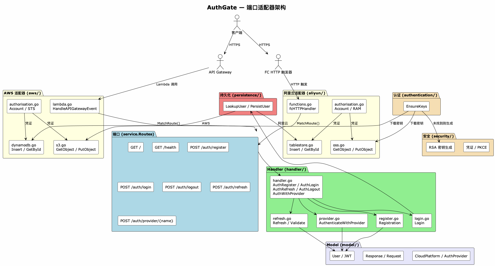
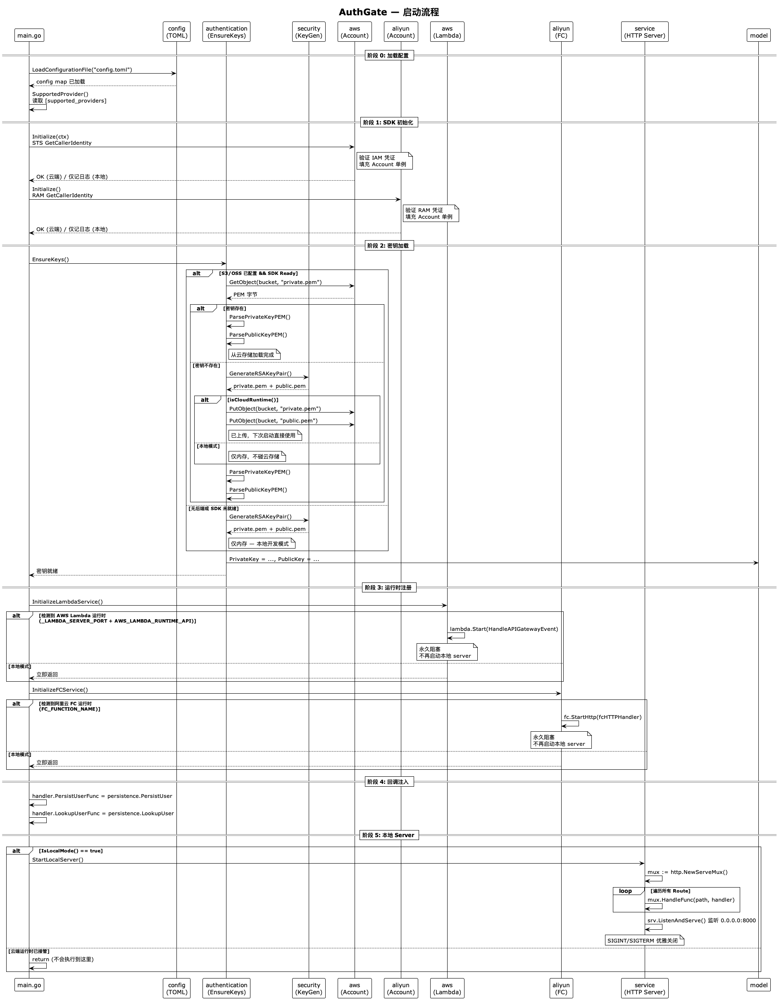
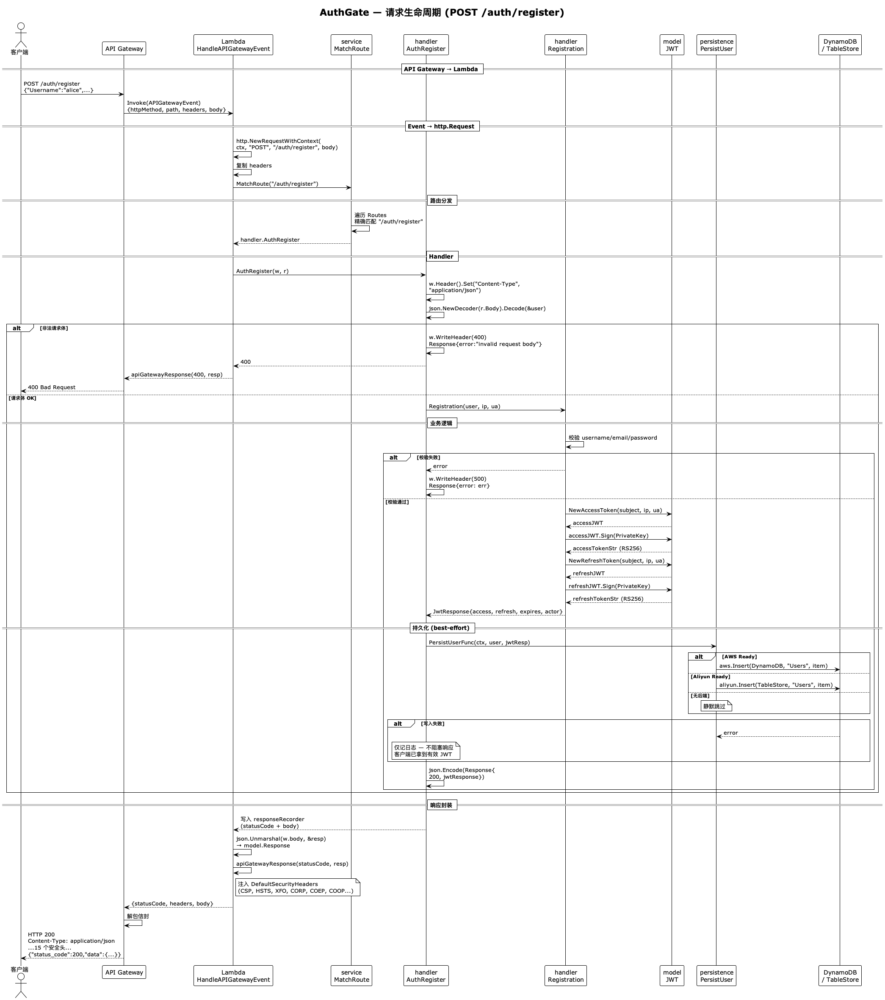
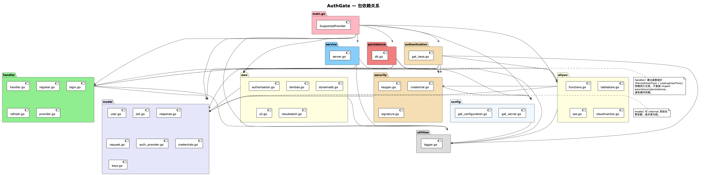
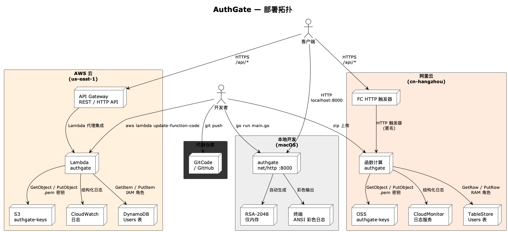

# AuthGate

**多云统一认证网关** — 一份 Go 代码，三种运行时（AWS Lambda、阿里云 FC、本地开发），共享同一路由表，零配置环境切换。

[](https://go.dev/)
[](https://datatracker.ietf.org/doc/html/rfc7519)

> [English Documentation](README.md)

---

## 目录

1. [架构设计](#架构设计)
2. [项目结构](#项目结构)
3. [快速开始](#快速开始)
4. [API 参考](#api-参考)
5. [安全检测](#安全检测)
6. [速率与突发检测](#速率与突发检测)
7. [配置参考](#配置参考)
8. [部署](#部署)
9. [可观测性与告警](#可观测性与告警)
10. [JWT 安全设计](#jwt-安全设计)
11. [设计决策](#设计决策)
12. [技术栈](#技术栈)

---

## 架构设计

**模式：Ports & Adapters + 回调注入 + 检测式安全层**

四层结构，三个核心机制：

```
                        main.go
  五阶段启动: Config → SDK Init → Keys → Runtime → Wire
        │            │            │           │
   ┌────▼───┐  ┌─────▼────┐  ┌────▼────┐  ┌──▼──────┐
   │Persist │  │ Lookup   │  │Security │  │ Routes  │  ← 3 个回调 + 1 张路由表
   │UserFunc│  │ UserFunc │  │ LogFunc │  │(7 端点)   │    全部注入，零循环依赖
   └────┬───┘  └────┬─────┘  └────┬────┘  └──┬──────┘
        │           │             │           │
   ┌────▼───────────▼─────────────▼───────────▼──────┐
   │                  handler/                        │
   │  SecurityMiddleware → 路由分发 → 业务逻辑        │
   │  (注册 / 登录 / 刷新 / 第三方登录)                │
   └────────────────────┬───────────────────────────┘
                        │
   ┌────────────────────┼───────────────────────────┐
   │                    │                            │
   ▼                    ▼                            ▼
┌──────────┐  ┌──────────────────┐  ┌──────────────────────┐
│ aws/     │  │ aliyun/          │  │ service/server.go    │
│ Lambda   │  │ FC 分发          │  │ net/http :8000        │
│ 分发     │  │                  │  │ 分发                  │
└────┬─────┘  └───────┬──────────┘  └──────────┬───────────┘
     │                │                        │
     ▼                ▼                        ▼
  CloudWatch      CloudMonitor              终端
  (JSON+EMF)      (JSON+SLS)              (ANSI)
```

| 层 | 包 | 职责 |
|---|---|---|
| **端口** | `service/` | `Routes` 切片 — 7 端点，唯一真相源 |
| **适配器** | `aws/` `aliyun/` | 云事件 → `http.HandlerFunc`；DynamoDB/TableStore/S3/OSS CRUD；CloudWatch/CloudMonitor 安全日志 |
| **业务** | `handler/` | 认证逻辑 + `SecurityMiddleware`（模式扫描 + 速率检测） |
| **共享内核** | `model/` | 纯数据结构，零内部依赖 |

**三个核心机制：**

1. **回调注入** — `handler/` 不 import 任何云包。三个函数指针（`PersistUserFunc`、`LookupUserFunc`、`SecurityLogFunc`）由 `main.go` 注入，打破 `handler → persistence → aws → service → handler` 的循环依赖。

2. **检测不阻断** — 每个请求经过模式扫描（13 组，~90 条正则）+ 滑动窗口速率检测（5 级阈值）。威胁日志写入 CloudWatch/SLS。永不阻断 — 阻断策略在 WAF 层执行。

3. **环境自适应** — `_LAMBDA_SERVER_PORT` → `lambda.Start()`，`FC_FUNCTION_NAME` → `fc.StartHttp()`，都没有 → `net/http :8000`。零配置切换。

### 架构图

`service.Routes` 是唯一端口 — 一个 `[]RouteEntry` 切片定义了所有 API 端点。三个适配器（`aws/lambda.go`、`aliyun/functions.go`、`service/server.go`）各自将平台特定的调用协议翻译为标准 `http.HandlerFunc`，统一对同一张路由表进行分发。

```
                          ┌──────────────────────────┐
                          │     service.Routes       │  ← 端口（唯一真相源）
                          │  7 条路由，所有环境共用    │
                          └─────┬──────────┬─────────┘
                                │          │
                ┌───────────────┘          └───────────────┐
                ▼                                          ▼
  ┌──────────────────────────┐           ┌──────────────────────────┐
  │      aws/lambda.go        │           │    aliyun/functions.go   │  ← 适配器
  │  API Gateway Proxy Event  │           │    FC HTTP 触发器        │
  │  → http.Request           │           │  → http.ResponseWriter   │
  └──────────────────────────┘           └──────────────────────────┘
                │                                          │
                └────────────────┬─────────────────────────┘
                                 ▼
                ┌────────────────────────────────┐
                │  handler（业务逻辑）              │
                │  注册 / 登录 / 刷新 / 登出 /     │
                │  第三方登录                      │
                ├────────────────────────────────┤
                │  security（中间件）               │
                │  模式扫描 + 速率检测              │
                ├────────────────────────────────┤
                │  persistence（DynamoDB/TableStore）│
                │  → 通过函数指针注入              │
                └────────────────────────────────┘
```



### 启动流程（5 阶段）

| 阶段 | 操作 | 云端（Lambda/FC） | 本地 |
|---|---|---|---|
| 0 | `config.LoadConfigurationFile` | 读取打包的 `config.toml` | 读取工作目录 |
| 1 | `aws.Initialize` / `aliyun.Initialize` | STS/RAM `GetCallerIdentity` 验证 IAM 角色 | 同 — 错误仅记日志，不致命 |
| 2 | `authentication.EnsureKeys` | 从 S3/OSS 下载 `.pem`；缺失→生成 RSA-2048→上传 | 生成 RSA-2048，仅内存 |
| 3 | `InitializeLambdaService` / `InitializeFCService` | 注册运行时 handler，**永久阻塞** | 立即返回（no-op） |
| 4 | 回调注入 | 注入 `PersistUserFunc`、`LookupUserFunc`、`SecurityLogFunc` | 同 |
| 5 | `StartLocalServer` | **永不执行**（运行时已接管） | `net/http` 监听 `0.0.0.0:8000` |



### 环境检测

运行时由云平台注入的环境变量决定：

| 环境变量 | 运行时 | 分发入口 |
|---|---|---|
| `_LAMBDA_SERVER_PORT` + `AWS_LAMBDA_RUNTIME_API` | AWS Lambda | `HandleAPIGatewayEvent(ctx, APIGatewayEvent)` |
| `FC_FUNCTION_NAME` | 阿里云 FC | `fcHTTPHandler(w, r)` 通过 `fc.StartHttp` |
| 以上皆无 | 本地开发 | `net/http.ServeMux` + `SecurityMiddleware` + `logRequest` |

### 请求生命周期（`POST /auth/register`）

```
客户端 → API Gateway → Lambda 调用
                           │
  APIGatewayEvent {         ▼
    httpMethod: "POST"     HandleAPIGatewayEvent()
    path: "/auth/register"   ├─ event → http.Request（重构标准请求）
    body: "{...}"            ├─ SecurityMiddleware 包裹 handler
  }                          │    ├─ RateTracker.Record(IP, Path)
                             │    ├─ io.ReadAll(body) → 缓冲
                             │    ├─ ScanRequest(body, path, query, headers)
                             │    │    └─ 13 组模式，~90 条正则
                             │    └─ 合并模式匹配 + 速率匹配结果
                             ├─ service.MatchRoute(path) → handler.AuthRegister
                             │    ├─ json.Decode(body) → model.User
                             │    ├─ Registration() → 校验 → JWT.Sign(RS256)
                             │    └─ PersistUserFunc() → DynamoDB/TableStore
                             └─ apiGatewayResponse() → {statusCode, headers, body}
                                  │
客户端 ← HTTP 200 ← API Gateway  ◄
```



### 不同运行时的响应路径差异

| 方面 | 本地 HTTP | AWS Lambda | 阿里云 FC |
|---|---|---|---|
| ResponseWriter | 真实 `http.ResponseWriter` | `responseRecorder`（捕获 body + status） | 真实 `http.ResponseWriter` |
| Handler 设的头 | 直接到客户端 | **被丢弃** — 被 `apiGatewayResponse` 覆写 | 在 handler 前设置；handler 可覆写 |
| 安全头 | 默认无 | `DefaultSecurityHeaders`（15 个头）注入 | `fcHTTPHandler` 注入 `DefaultSecurityHeaders` |
| Body 处理 | 直接流 | 解码 → 重新编码（双重序列化） | 直接流 |
| 响应信封 | 原始 HTTP | `{statusCode, headers, body}`（Lambda 代理格式） | 原始 HTTP（FC 运行时解包） |

---

## 项目结构

```
AuthGate/
├── main.go                          入口，5 阶段启动编排
├── config.toml                      运行时配置（凭证、表、桶）
├── config.toml.example              配置模板 — 复制填写
├── go.mod / go.sum                  Go 1.26 模块依赖
├── postman_collection.json          Postman 测试集合（7 端点 + 测试脚本）
├── README.md / README_CN.md         文档（英文 / 中文）
├── docs/                            PlantUML 图（中英文）
├── out/docs/                        渲染后的 PNG 图
│
└── internal/
    ├── model/                       领域模型 — 零内部依赖（共享内核）
    │   ├── user.go                  User（GORM 标签，MySQL 预留）
    │   ├── jwt.go                   JWT 结构体, Sign(RS256), Validate(), NewAccessToken/RefreshToken
    │   ├── response.go              Response, JwtResponse, Actor, EventType 常量
    │   ├── request.go               RequestHttpHeader（15 安全头）, EmailPasswordAuthRequest
    │   ├── provider.go              CloudPlatform 枚举（10 种云平台）
    │   ├── auth_provider.go         AuthProvider 枚举（8 种第三方登录）
    │   ├── credentials.go           AWSAuthorisationKeys, AliyunAuthorisationKeys, KeysConfig
    │   ├── keys.go                  PrivateKey / PublicKey 全局单例
    │   └── handler.go               APIGatewayEvent 结构体（Lambda 代理集成）
    │
    ├── config/                      TOML 配置层
    │   ├── get_configuration.go     LoadConfigurationFile(), GetValue(点号分隔键)
    │   └── get_server.go            Addr 常量, 7 条路由路径常量
    │
    ├── handler/                     HTTP handler + 业务逻辑
    │   ├── handler.go               Index, Health, AuthRegister, AuthLogin, AuthLogout,
    │   │                            AuthRefresh, AuthWithProvider, extractProvider
    │   ├── register.go              Registration() — 校验 + JWT access/refresh 签发
    │   ├── login.go                 Login() — LookupUserFunc → 密码校验 → JWT 签发
    │   ├── refresh.go               Refresh() — RS256 验证, scope 检查, 重新签发
    │   │                            ValidateAccessToken() — 公共 JWT 校验工具
    │   ├── provider.go              AuthenticateWithProvider() — 8 种第三方
    │   └── middleware.go            SecurityMiddleware — 模式扫描 + 速率检测 per request
    │
    ├── service/                     服务编排
    │   └── server.go                Routes（唯一路由表）, MatchRoute(),
    │                                IsLocalMode(), StartLocalServer() 优雅关闭
    │
    ├── authentication/              JWT 密钥生命周期管理
    │   └── get_keys.go              EnsureKeys() — 下载 → 生成 → 上传 → 安装
    │                                GetPrivateKey(), GetPublicKey() 访问器
    │
    ├── security/                    安全基础设施
    │   ├── monitor.go               ScanRequest() — 13 组模式, ~90 条编译正则
    │   │                            4 级严重度, 多源扫描（body/path/query/headers）
    │   ├── ratelimit.go             RateTracker — 滑动窗口, per-IP/path/IP+path/全局
    │   │                            5 级阈值 → ThreatMatch 发射
    │   ├── keygen.go                GenerateRSAKeyPair() — RSA-2048, PKCS#8 PEM
    │   │                            ParsePrivateKeyPEM(), ParsePublicKeyPEM()
    │   ├── credential.go            AWSCredentials(), AliyunCredentials(), KeysConfig()
    │   └── signature.go             PKCE: ComputeCodeChallenge(), ValidateCodeVerifier()
    │
    ├── persistence/                 数据库桥接层（回调注入模式）
    │   └── db.go                    LookupUser(), PersistUser() — 自动检测 DynamoDB/TableStore
    │                                Ready() 检查防止未初始化 SDK panic
    │
    ├── aws/                         AWS 适配器
    │   ├── authorisation.go         Account 单例, Initialize() 通过 STS GetCallerIdentity
    │   ├── lambda.go                HandleAPIGatewayEvent(), responseRecorder,
    │   │                            apiGatewayResponse() 带安全头
    │   ├── dynamodb.go              Insert, GetById, Update, DeleteById — 延迟客户端
    │   ├── s3.go                    GetObject, PutObject, ListObjects, PresignedURL
    │   └── cloudwatch.go            LogSecurityEvent (JSON), EmitSecurityMetric (EMF),
    │                                LogStartupInfo, LogThreatSummary,
    │                                内置 Metric Filter + Alarm 配置文档
    │
    ├── aliyun/                      阿里云适配器
    │   ├── authorisation.go         Account 单例, Initialize() 通过 RAM GetCallerIdentity
    │   ├── functions.go             fcHTTPHandler(), responseRecorder,
    │   │                            InitializeFCService() 自动检测
    │   ├── tablestore.go            Insert, GetById, Update, DeleteById — 延迟客户端
    │   ├── oss.go                   GetObject, PutObject, ListObjects, PresignedURL
    │   └── cloudmonitor.go          LogSecurityEvent (JSON), LogStartupInfo,
    │                                LogThreatSummary, 内置 SLS 查询 + 告警规则文档
    │
    └── utilities/                   共享工具
        └── logger.go                结构化块日志（Logf），ANSI 彩色输出，
                                     CloudWatch/SLS 兼容，协程关联（TASK-###），
                                     Mask(), RetryWithBackoff(), Bold()
```



**关键依赖规则：** `model/` 对 `internal/` 其他包零依赖。`handler/` 仅通过函数指针（`PersistUserFunc`、`LookupUserFunc`、`SecurityLogFunc`，由 `main.go` 注入）与 `aws`/`aliyun` 交互 — 无循环依赖。

---

## 快速开始

### 前提条件

- **Go ≥ 1.26**
- （可选）AWS 账号 + IAM 用户（S3 + DynamoDB + STS 权限）
- （可选）阿里云账号 + RAM 用户（OSS + TableStore + RAM 权限）
- **Docker + docker compose v2**（可选 — 一键本地开发）

### Docker Compose — 一键启动

```bash
docker compose up
# AuthGate :8000 + LocalStack :4566 (S3 + DynamoDB 模拟)
# 全部 10 个端点立即可用，零配置
```

### 裸机 — 零依赖

```bash
cp config.toml.example config.toml
go run main.go
```

启动时自动完成：
1. 解析 `config.toml`
2. `authentication.EnsureKeys()` 检测无云后端配置
3. RSA-2048 密钥对**仅在内存中生成**（不落盘，不碰云）
4. 本地 `net/http` 服务器启动在 `0.0.0.0:8000`
5. 安全中间件已激活 — 模式扫描 + 速率追踪

所有 7 个端点立即可用。无需 AWS 账号、无需阿里云账号、无需数据库。

### 连接云服务

```toml
[supported_providers]
aws = true

[aws]
region = "us-east-1"
access_key_id = "AKIA..."
access_key_secret = "..."
bucket = "authgate-keys"       # S3 桶存放 RSA 密钥
dynamodb_table = "Users"       # DynamoDB 表（Hash Key: username, String）
```

重启后自动：
1. STS `GetCallerIdentity` 验证 IAM 凭证 → `Account` 单例就绪
2. `EnsureKeys()` 从 S3 下载 `private.pem` / `public.pem`
3. 如不存在 → 生成 RSA-2048 → 上传至 S3（下次冷启动直接使用）
4. `PersistUser` / `LookupUser` 读写 DynamoDB `Users` 表
5. 安全事件以结构化 JSON 发射至 CloudWatch Logs + EMF 指标

---

## API 参考

### 端点汇总

| # | Method | Path | 请求体 | 成功（200） | 错误 |
|---|---|---|---|---|---|
| 1 | `GET` | `/` | — | `{"service":"AuthGate","status":"running"}` | — |
| 2 | `GET` | `/health` | — | `{"status":"healthy"}` | — |
| 3 | `POST` | `/auth/register` | `User` JSON | `JwtResponse` + 持久化 | 400 / 500 |
| 4 | `POST` | `/auth/login` | `EmailPasswordAuthRequest` | `JwtResponse` | 401 |
| 5 | `POST` | `/auth/logout` | `{"access_token":"..."}` | `{"message":"已登出"}` | — |
| 6 | `POST` | `/auth/refresh` | `{"refresh_token":"..."}` | 新 `JwtResponse` 对 | 401 |
| 7 | `POST` | `/auth/provider/{name}` | `{"subject":"...","email":"..."}` | `JwtResponse` | 400 / 401 |

### 请求/响应 Schema

**POST /auth/register**
```json
// 请求
{
  "Username": "alice",           // 必填，1-50 字符
  "Email": "alice@example.com",  // 必填，有效邮箱
  "Password": "secret123"        // 必填，当前明文存储（bcrypt 待实现）
}

// 响应 200
{
  "status_code": 200,
  "data": {
    "token": "eyJhbGciOiJSUzI1NiIs...",       // RS256 签名的 access token
    "refresh_token": "eyJhbGciOiJSUzI1NiIs...", // RS256 签名的 refresh token
    "expires_in": 3600,                          // 秒
    "event_type": "event.auth_register",
    "actor": {
      "idenitifier": "alice",
      "ip_address": "127.0.0.1:52079",
      "user_agent": "curl/8.7.1"
    }
  }
}
```

**POST /auth/login**
```json
// 请求
{"username": "alice", "password": "secret123"}

// 响应 200 — 同 register 的 JwtResponse schema
// 响应 401 — {"status_code":401,"data":{"error":"用户名或密码错误"}}
```

**POST /auth/refresh**
```json
// 请求
{"refresh_token": "eyJhbGciOiJSUzI1NiIs..."}

// 响应 200 — 新 JwtResponse，event_type = "event.auth_refresh"
// 响应 401 — {"status_code":401,"data":{"error":"refresh token 无效或已过期"}}
```

**POST /auth/provider/{name}**
```json
// 请求（Google）
{"subject": "google-oauth2|123456789", "email": "alice@gmail.com"}

// 响应 200 — JwtResponse，subject 从第三方身份派生
```

### 支持的第三方登录

| 平台 | `{name}` | Subject 格式 |
|---|---|---|
| Google OAuth | `google` | `google-oauth2\|{id}` |
| GitHub OAuth | `github` | `github\|{id}` |
| 微信 | `weixin` | `wechat-openid\|{openid}` |
| 微博 | `weibo` | `weibo\|{uid}` |
| 抖音 | `douyin` | `dy\|{openid}` |
| TikTok | `tiktok` | `tt\|{openid}` |
| 快手 | `kuaishou` | `ks\|{openid}` |
| GitCode | `gitcode` | `gitcode\|{uid}` |

### 错误响应格式

所有错误使用统一信封：

```json
{
  "status_code": 401,
  "signature": "",
  "event": null,
  "data": {
    "error": "人类可读的错误消息"
  }
}
```

---

## 安全检测

每个请求在到达 handler 之前都经过 `SecurityMiddleware`。中间件执行两项独立检查：

### 1. 基于模式的威胁检测（`security/monitor.go`）

`ScanRequest(body, path, query, headers)` 对**四个输入源**（请求体、URL 路径、查询字符串、每个 header 值）运行 ~90 条编译正则，覆盖 **13 组攻击模式**：

| # | 类别 | 严重度 | 规则数 | 检测逻辑 |
|---|---|---|---|---|
| 1 | `SQL_INJECTION` | 严重 | 13 | SQL 关键字（`UNION SELECT`、`DROP TABLE`）、永真式（`OR '1'='1'`）、注释序列（`--`、`/* */`）、延时注入（`SLEEP(5)`、`WAITFOR DELAY`）、存储过程（`xp_cmdshell`） |
| 2 | `COMMAND_INJECTION` | 严重 | 6 | Shell 命令分隔符（`;`、`|`、`&&`）后跟系统命令（`cat`、`ls`、`wget`、`curl`、`nc`、`bash`、`python`），反引号与 `$()` 子 shell |
| 3 | `XSS` | 高危 | 9 | Script 标签、内联事件处理器（`onerror`、`onload`、`onclick`）、`javascript:` URI、`eval()`、`document.cookie`、iframe 注入 |
| 4 | `PATH_TRAVERSAL` | 高危 | 7 | 目录回溯（`../../`）、URL 编码变体（`%2e%2e%2f`）、系统路径（`/etc/passwd`、`/proc/self/environ`、`C:\Windows\System32`） |
| 5 | `SSRF` | 高危 | 6 | AWS 元数据端点（`169.254.169.254`）、GCP 元数据、环回地址、链路本地 IP |
| 6 | `FILE_INCLUSION` | 高危 | 4 | PHP/远程协议包装器（`php://`、`http://`、`ftp://`、`data://`）、WordPress 路径、敏感文件扩展名（`.ini`、`.cfg`、`.sql`） |
| 7 | `NOSQL_INJECTION` | 高危 | 2 | MongoDB 操作符（`$gt`、`$ne`、`$regex`、`$where`、`$elemMatch`） |
| 8 | `SENSITIVE_FILE` | 高危 | 16 | 环境文件（`.env`、`.env.production`）、版本控制目录（`.git/`、`.svn/`）、配置文件（`config.json`、`settings.yml`）、SSH 密钥（`id_rsa`）、Docker 文件、Shell 历史、phpMyAdmin 路径 |
| 9 | `DIR_BRUTE_FORCE` | 中危 | 9 | 管理面板（`/admin`、`/wp-admin`、`/phpmyadmin`）、Spring Boot Actuator（`/actuator/env`、`/heapdump`）、DevOps 工具（`/jenkins`、`/grafana`、`/consul`）、API 浏览器（`/swagger`、`/graphql`） |
| 10 | `XML_ATTACK` | 高危 | 4 | XXE（`<!ENTITY ... SYSTEM`）、DTD 声明、CDATA 块 |
| 11 | `CROSS_ORIGIN` | 中危 | 3 | 表单中的 CSRF token 模式、跨域被阻止头 |
| 12 | `HEADER_INJECTION` | 中危 | 2 | 请求值中的 HTTP 响应头（`\r\nLocation:`、`\r\nSet-Cookie:`） |
| 13 | `SCANNER_UA` | 低危 | 1 | 已知安全扫描器 User-Agent（sqlmap、nikto、nessus、burp、zap、nmap、gobuster、hydra、metasploit） |

### 2. 速率与突发检测（`security/ratelimit.go`）

滑动窗口 `RateTracker`（默认：60 秒窗口，每秒桶）对每个请求追踪四个维度：

| 维度 | 键 | 阈值 | 类别 | 严重度 |
|---|---|---|---|---|
| 同一 IP → 同一路径 | `{IP}\|{Path}` | ≥ 100 次/60s | `RATE_BURST_IP_PATH` | 高危 |
| 同一 IP（所有路径） | `{IP}` | ≥ 500 次/60s | `RATE_BURST_IP` | 高危 |
| 同一路径（所有 IP） | `{Path}` | ≥ 1,000 次/60s | `RATE_BURST_PATH` | 中危 |
| 全局（所有流量） | `global` | ≥ 5,000 次/60s | `RATE_STORM` | 严重 |
| 升高（预警） | `{IP}\|{Path}` | ≥ 10 次/60s | `RATE_ELEVATED_IP_PATH` | 低危 |

### 检测输出

匹配结果（模式 + 速率）合并后路由至活跃云平台：

- **AWS Lambda**：`LogSecurityEvent()` → 结构化 JSON 至 CloudWatch Logs + `EmitSecurityMetric()` → CloudWatch EMF（`AuthGate/Security.ThreatDetected`）
- **阿里云 FC**：`LogSecurityEvent()` → 结构化 JSON 至 SLS
- **本地**：`utilities.LogProgress("Security", ...)` → ANSI 彩色终端输出

**请求永不被阻断** — 这是纯检测模式。阻断在 WAF / API Gateway 限流层处理。

---

## 速率与突发检测

`security/ratelimit.go` 中的 `RateTracker` 使用滑动窗口算法，每秒桶粒度：

```
窗口: 60 秒, 桶: 60 个（每秒一个）

t=0:  [0,0,0,0,0,...0]   head=0
t=1:  [5,0,0,0,0,...0]   head=1  （第 1 秒 5 个请求）
t=2:  [5,3,0,0,0,...0]   head=2  （第 2 秒 3 个请求）
...
t=59: [5,3,2,...,1]      head=59
t=60: [0,3,2,...,1,0]    head=0  （第 0 秒的桶被清零）

任意时刻的 sum = 最近 60 秒内的总请求数
```

当任意维度的 `sum >= 阈值` 时，发射对应严重度的 `ThreatMatch`。追踪器并发安全（`sync.Mutex`）。

---

## 配置参考

```toml
title = "AuthGate"

# ── 服务器 ──
[server]
host = "0.0.0.0"     # 绑定地址（仅本地模式）
port = 8000           # 绑定端口（仅本地模式）

# ── 云平台开关 ──
# 至少一个为 true。仅启用的平台会初始化 SDK。
[supported_providers]
aws = true
aliyun = true
azure = false
gcp = false
tencent_cloud = false

# ── AWS ──
# IAM 用户需要: s3:GetObject, s3:PutObject, dynamodb:GetItem,
#   dynamodb:PutItem, dynamodb:UpdateItem, sts:GetCallerIdentity
[aws]
region = "us-east-1"
access_key_id = "AKIA..."
access_key_secret = "..."
bucket = "authgate-keys"       # S3 桶，存放 RSA 密钥
dynamodb_table = "Users"       # DynamoDB 表（Hash Key: username, String）

# ── 阿里云 ──
# RAM 用户需要: oss:GetObject, oss:PutObject, ots:GetRow,
#   ots:PutRow, ots:UpdateRow, sts:GetCallerIdentity
[aliyun]
region = "cn-hangzhou"
access_key_id = "LTAI..."
access_key_secret = "..."
bucket = "authgate-keys"               # OSS 桶，存放 RSA 密钥
endpoint = "oss-cn-hangzhou.aliyuncs.com"
tablestore_instance = "authgate"       # TableStore 实例名
tablestore_table = "Users"             # TableStore 表（PK: username, String）

# ── JWT 签名密钥在对象存储中的路径 ──
[keys]
private_key_path = "private.pem"
public_key_path = "public.pem"

# ── MySQL（预留，当前未使用）──
[database]
host = "localhost"
port = 3306
user = "root"
password = "..."
dbname = "authgate"
max_connections = 50
max_idle_connections = 10
```

### 环境变量

| 变量 | 用途 | 默认值 |
|---|---|---|
| `LOG_LEVEL` | 最低日志级别（`DEBUG`/`INFO`/`WARN`/`ERROR`/`VERBOSE`） | `INFO` |
| `_LAMBDA_SERVER_PORT` | Lambda 运行时设置 — 触发 Lambda 模式 | — |
| `AWS_LAMBDA_RUNTIME_API` | Lambda 运行时设置 — 触发 Lambda 模式 | — |
| `FC_FUNCTION_NAME` | FC 运行时设置 — 触发 FC 模式 | — |

### 最小 IAM 权限（AWS）

```json
{
  "Version": "2012-10-17",
  "Statement": [
    {
      "Effect": "Allow",
      "Action": [
        "s3:GetObject",
        "s3:PutObject",
        "dynamodb:GetItem",
        "dynamodb:PutItem",
        "dynamodb:UpdateItem",
        "sts:GetCallerIdentity"
      ],
      "Resource": [
        "arn:aws:s3:::authgate-keys/*",
        "arn:aws:dynamodb:*:*:table/Users"
      ]
    }
  ]
}
```

---

## 部署



### AWS Lambda + API Gateway

```bash
GOOS=linux GOARCH=arm64 go build -o bootstrap main.go
zip deployment.zip bootstrap

aws lambda update-function-code \
  --function-name authgate \
  --zip-file fileb://deployment.zip
```

**API Gateway 配置：**
- 类型：REST API 或 HTTP API（v2）
- 集成：Lambda Proxy
- 路由：`ANY /{proxy+}` → `authgate` 函数
- Payload 格式版本：2.0

**冷启动流程：**
1. Lambda INIT 阶段：`main()` 执行 → SDK 初始化 → 密钥下载/生成 → `lambda.Start(HandleAPIGatewayEvent)` 阻塞
2. Lambda INVOKE 阶段：API Gateway 事件到达 → `HandleAPIGatewayEvent` → `SecurityMiddleware` → 路由分发 → 响应信封 → API Gateway → 客户端

### 阿里云 FC

```bash
GOOS=linux GOARCH=amd64 go build -o main main.go
zip function.zip main
```

**FC 控制台配置：**
- 运行时：Custom Runtime（Go）
- 触发器：HTTP 触发器，认证方式：匿名
- 内存：建议最低 512 MB

### 本地构建

```bash
go build -o authgate main.go
./authgate
```

---

## 可观测性与告警

### 日志格式

所有日志写入 **stdout**（Lambda 和 FC 运行时自动捕获）：

```
[AuthGate@20260616:08:43:35CST]::INFO:: (aws:init>>TASK-001::Initialize)
  | Status   : IN_PROGRESS
  | Type     : ACTION
  | Memory   : 2.19MB
  | Routine  : TASK-001
  | Elapsed  : 0μs
  | Progress : success
  | AWS account initialized successfully | account_id : 280362093548 ...
```

### 安全事件（CloudWatch / SLS）

```json
{
  "timestamp": "2026-06-16T08:43:35Z",
  "event": "security.threat",
  "severity": "CRITICAL",
  "category": "SQL_INJECTION",
  "match_count": 3,
  "path": "/auth/login",
  "method": "POST",
  "source_ip": "198.51.100.4",
  "user_agent": "sqlmap/1.0",
  "matches": [{
    "category": "SQL_INJECTION",
    "severity": 3,
    "pattern": "(?i)(\\bOR\\s+('|\")\\d+('|\")\\s*=\\s*('|\")\\d+('|\"))",
    "location": "body",
    "sample": "admin' OR '1'='1 --"
  }],
  "lambda_request_id": "c6a4e5..."
}
```

### CloudWatch — Metric Filter 与告警

在 AWS 控制台创建（CloudWatch → 日志组 → `/aws/lambda/authgate` → Metric filter）：

| 筛选模式 | 指标名 | 告警阈值 | 动作 |
|---|---|---|---|
| `{ $.severity = "CRITICAL" }` | `ThreatCritical` | ≥ 1 per 1 min | SNS → PagerDuty |
| `{ $.severity = "HIGH" }` | `ThreatHigh` | ≥ 3 per 5 min | SNS → Slack |
| `{ $.category = "SQL_INJECTION" }` | `ThreatSQLi` | ≥ 1 per 1 min | SNS → 安全团队邮件 |
| `{ $.category = "RATE_STORM" }` | `RateStorm` | ≥ 1 per 1 min | SNS → PagerDuty |
| `{ $.category = "SENSITIVE_FILE" }` | `SensitiveFile` | ≥ 3 per 5 min | SNS → 安全团队邮件 |

### CloudMonitor（SLS）— 告警规则

在阿里云控制台创建（SLS → Logstore → 告警）：

| 查询 | 触发条件 | 通知 |
|---|---|---|
| `severity: CRITICAL \| SELECT COUNT(*) AS cnt` | cnt ≥ 1 | 电话 + 短信 + 飞书 |
| `severity: HIGH \| SELECT COUNT(*) AS cnt` | cnt ≥ 3 | 飞书群机器人 Webhook |
| `category: SQL_INJECTION \| SELECT COUNT(*) AS cnt` | cnt ≥ 1 | 安全团队邮件 |
| `category: RATE_STORM \| SELECT COUNT(*) AS cnt` | cnt ≥ 1 | 电话 + 钉钉 |

---

## JWT 安全设计

| 特性 | 实现 |
|---|---|
| 签名算法 | RS256（RSA 2048-bit 密钥对） |
| Access Token 有效期 | 3600s（1 小时） |
| Refresh Token 有效期 | 604800s（7 天） |
| Token 绑定 | `ip_address` + `user_agent` 写入 claims |
| Scope 隔离 | access → `api:access`，refresh → `token:refresh`（刷新时校验） |
| 唯一标识 | `jti` — 每条 token UUID v4，支持未来黑名单 |
| 密钥轮换 | 从 S3/OSS 删除 `.pem` → 下次冷启动自动生成新密钥对 |
| 密钥存储 | S3/OSS SSE（服务端加密）；本地模式仅内存 |
| Bearer Token 格式 | `Authorization: Bearer eyJ...` 或原始 token 字符串 |

### Claims 结构

```json
{
  "jti": "uuid-v4",
  "sub": "alice",
  "iss": "authgate",
  "iat": 1781527500,
  "nbf": 1781527500,
  "exp": 1781531100,
  "created_at": 1781527500,
  "token_type": "Bearer",
  "scopes": ["api:access"],
  "ip_address": "198.51.100.4",
  "user_agent": "Mozilla/5.0..."
}
```

### 安全响应头

每个响应注入（AWS Lambda 和阿里云 FC 模式）：

```
Content-Security-Policy: default-src 'self'; script-src 'self'; frame-ancestors 'none'; form-action 'self'; base-uri 'self'
Strict-Transport-Security: max-age=63072000; includeSubDomains; preload
X-Content-Type-Options: nosniff
X-Frame-Options: DENY
Referrer-Policy: strict-origin-when-cross-origin
Permissions-Policy: camera=(), microphone=(), geolocation=()
Cross-Origin-Resource-Policy: same-origin
Cross-Origin-Embedder-Policy: require-corp
Cross-Origin-Opener-Policy: same-origin
Access-Control-Allow-Methods: GET, POST, PUT, DELETE, OPTIONS, PATCH
Access-Control-Allow-Headers: Content-Type, Authorization, X-Request-ID, X-API-Key
Access-Control-Max-Age: 86400
Access-Control-Expose-Headers: X-Request-ID, X-RateLimit-Remaining, X-RateLimit-Reset
```

---

## 设计决策

### 为什么是 Ports & Adapters，而非 DDD？

认证是**技术关注点**，不是复杂业务领域。没有聚合根、没有领域事件、没有限界上下文能受益于 DDD 的战术模式。简化的 Ports & Adapters — `service.Routes` 是端口，`aws/`/`aliyun/` 是适配器，`model/` 是共享内核 — 比例适当且可维护。

### 为什么用函数指针注入，而非接口？

`handler.PersistUserFunc`、`handler.LookupUserFunc` 和 `handler.SecurityLogFunc` 是函数指针而非 Go 接口。这是有意为之：

- **更轻量**：无需定义接口、无需实现 struct、无需构造函数。
- **避免循环依赖**：`handler` 不 import `aws`、`aliyun` 或 `persistence`。打破了 `handler → persistence → aws → service → handler` 的循环。
- **易于测试**：测试中直接赋值 mock 函数：`handler.LookupUserFunc = func(...) {...}`。

代价是失去了编译期接口实现检查。对于三个回调而言，这是可以接受的。

### 为什么是单一路由表？

`service.Routes` 是一个 `[]RouteEntry` 切片。三个 dispatch 层（`server.go`、`lambda.go`、`functions.go`）都遍历它（或调用 `MatchRoute()`）。新增端点只需在切片中添加一条 — 本地、Lambda、FC 三个环境同时生效。

### 为什么只检测不阻断？

安全中间件扫描每个请求但永不返回 403。理由：
1. **误报**：基于正则的检测必然产生误报（例如 JSON 字段 `"description"` 包含 "SELECT" 字样）。
2. **关注点分离**：阻断属于边缘层（WAF、API Gateway 限流、CloudFront 速率规则）。AuthGate 提供信号；边缘执行策略。
3. **先观测后行动**：先运行一周检测模式，调整告警阈值，再在 WAF 层添加阻断规则。

### 为什么密码明文存储？

当前版本将密码原样写入 DynamoDB/TableStore。生产环境应在 `Registration()` 和 `Login()` 中添加 bcrypt 哈希。这是最高优先级的安全待办事项。

---

## 技术栈

| 依赖 | 版本 | 用途 |
|---|---|---|
| `github.com/golang-jwt/jwt/v5` | v5.3.1 | RS256 JWT 签名、验证、claims 解析 |
| `github.com/google/uuid` | v1.6.0 | UUID v4 JTI 生成 |
| `github.com/BurntSushi/toml` | v1.6.0 | TOML 配置解析 |
| `github.com/aws/aws-sdk-go-v2` | v1.42.0 | AWS SDK v2（config, credentials, STS） |
| `github.com/aws/aws-sdk-go-v2/service/dynamodb` | v1.59.0 | DynamoDB GetItem / PutItem / UpdateItem |
| `github.com/aws/aws-sdk-go-v2/service/s3` | v1.103.3 | S3 GetObject / PutObject |
| `github.com/aws/aws-lambda-go` | v1.54.0 | Lambda 运行时（`lambda.Start`） |
| `github.com/aliyun/alibaba-cloud-sdk-go` | v1.63.107 | 阿里云 STS |
| `github.com/aliyun/aliyun-oss-go-sdk` | v3.0.2 | OSS GetObject / PutObject |
| `github.com/aliyun/aliyun-tablestore-go-sdk` | — | TableStore GetRow / PutRow / UpdateRow |
| `github.com/aliyun/fc-runtime-go-sdk` | v0.3.1 | FC 运行时（`fc.StartHttp`） |
| `gorm.io/gorm` | v1.31.1 | ORM（MySQL 预留） |

---

## 项目统计

| 指标 | 数值 |
|---|---|
| Go 源文件 | 44 |
| API 端点 | 10 |
| 单元测试 | 26（全部通过） |
| 性能基准 | 8 |
| 威胁检测模式 | 13 类，~90 条编译正则 |
| 速率限制阈值 | 5 级 × 4 维度 |
| 安全响应头 | 每响应 15 个 |
| 云平台 | 10 个定义（AWS + 阿里云已实现） |
| 第三方登录 | 8 种 |
| PlantUML 图 | 20 张（中英文） |
| Docker 镜像大小 | ~5 MB（Alpine，多阶段构建） |
| Health 端点吞吐 | 220k req/s（M2） |
| JWT 验证吞吐 | 8.8k req/s（RS256） |
| JWT 签名吞吐 | 400 req/s（RS256） |
| bcrypt 哈希时间 | ~580ms（cost=12） |

---

## 许可证

MIT License. Copyright (c) 2026 ctkqiang. 完整文本见 [LICENSE](LICENSE)。

---

## 支持

如果您觉得本项目对您有帮助，欢迎请我喝杯咖啡 ☕️，您的支持是我持续维护和改进的动力！

<p align="center">
  <strong>微信扫码捐赠</strong><br/>
  
</p>
